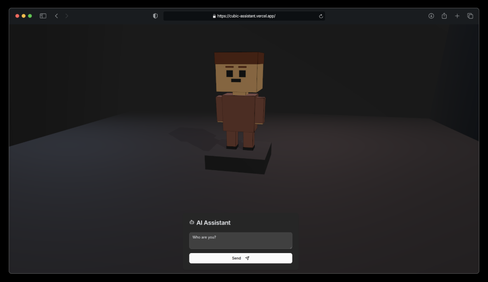

# Cubic Assistant

A 3D interactive AI assistant built with Three.js and React Three Fiber, featuring an cubic character that gives voice responses to user input.

## Features

- Interactive 3D cubic character entirely modeled in code, including animations
- Spoken AI conversations
- Admin mode with character controls and debug options

## Tech Stack

- **Framework**: Next.js 15
- **UI**: React 19, shadcn/ui, Tailwind CSS
- **3D Rendering**: Three.js, React Three Fiber, React Three Drei
- **State Management**: Jotai
- **Data Fetching**: React Query
- **Animations**: Motion (formerly Framer Motion)
- **Linting/Formatting**: Biome.js
